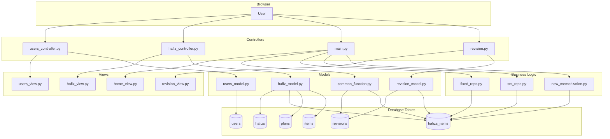
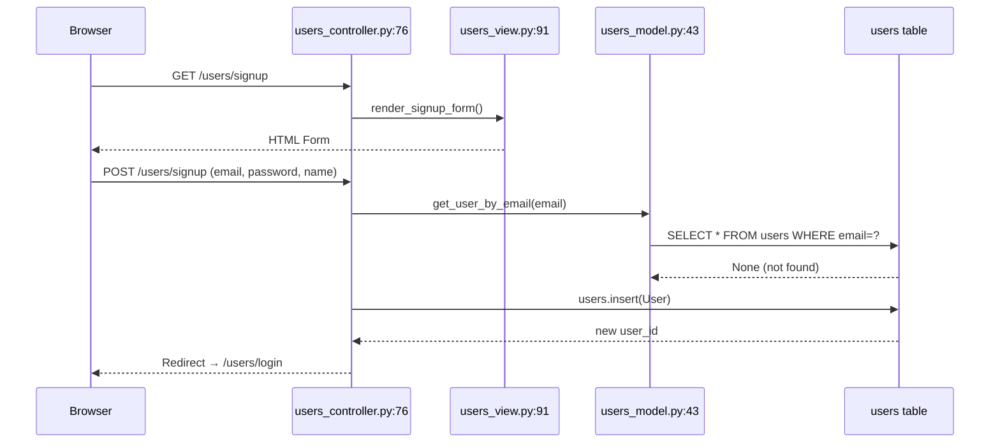
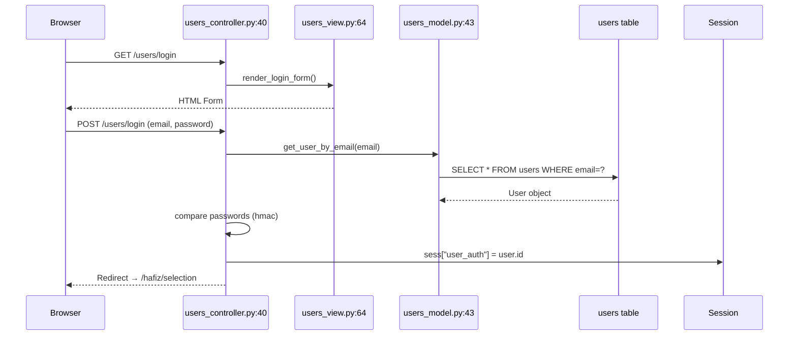
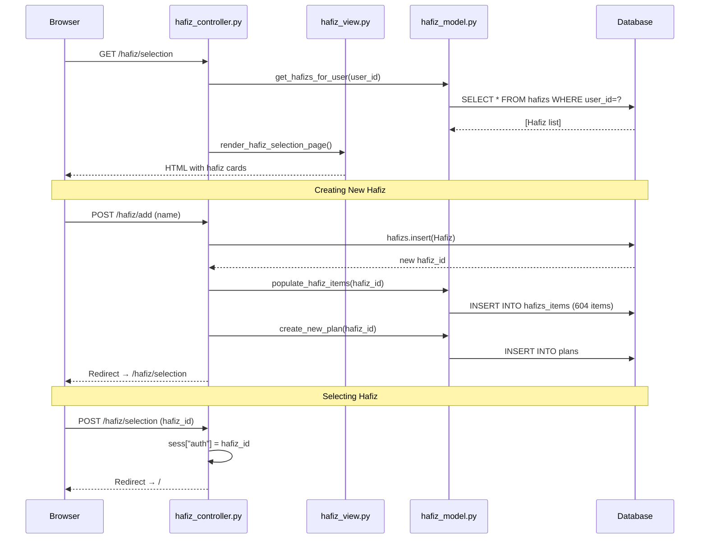
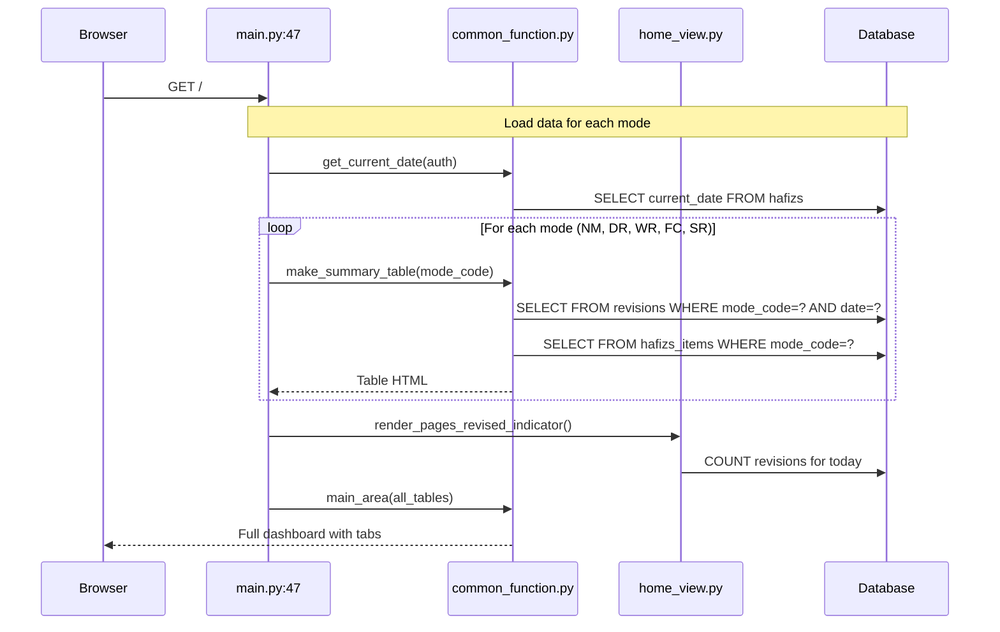
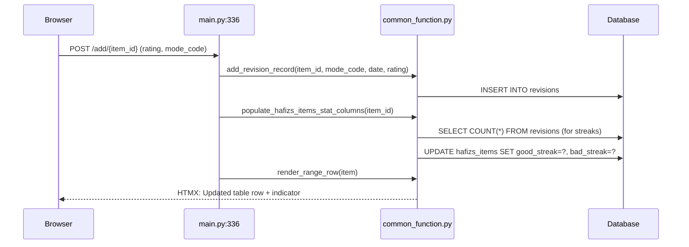
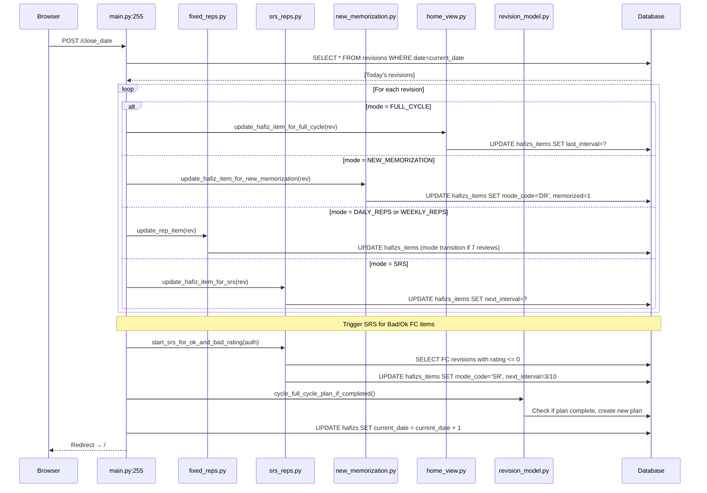
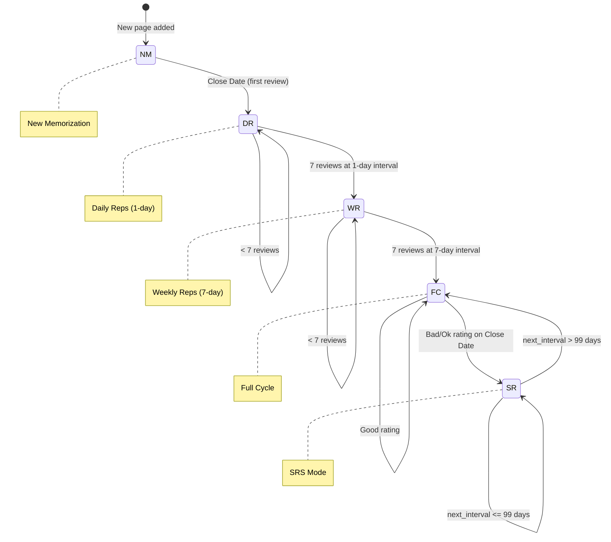

# Quran SRS - User Journey Diagrams

Visual walkthrough of the codebase showing which files are touched during each user journey.

---

## 1. High-Level Architecture Overview

---

## 2. Signup Journey

**Route**: `POST /users/signup`

**Files touched**: `users_controller.py` → `users_view.py` → `users_model.py` → `users` table

---

## 3. Login Journey

**Route**: `POST /users/login`

**Files touched**: `users_controller.py` → `users_view.py` → `users_model.py` → `users` table

---

## 4. Hafiz Selection & Creation Journey

**Routes**: `GET /hafiz/selection`, `POST /hafiz/add`, `POST /hafiz/selection`

**Files touched**: `hafiz_controller.py` → `hafiz_view.py` → `hafiz_model.py` → `hafizs`, `hafizs_items`, `plans`, `items` tables

---

## 5. Home Page Dashboard Journey

**Route**: `GET /`

**Files touched**: `main.py` → `common_function.py` → `home_view.py` → `hafizs`, `hafizs_items`, `revisions`, `items`, `modes`, `plans` tables

---

## 6. Adding a Revision Journey

**Route**: `POST /add/{item_id}`

**Files touched**: `main.py` → `common_function.py` → `revisions`, `hafizs_items` tables

---

## 7. Close Date Journey (Most Complex!)

**Route**: `POST /close_date`

**Files touched**: `main.py` → `fixed_reps.py` → `srs_reps.py` → `new_memorization.py` → `home_view.py` → `revision_model.py` → `revisions`, `hafizs_items`, `hafizs`, `plans` tables

---

## 8. Mode Progression State Diagram

Shows how items move through the 5 modes based on reviews and ratings.

---

## File Touch Summary Table

| Journey | Controllers | Views | Models | DB Tables |
|---------|-------------|-------|--------|-----------|
| **Signup** | users_controller.py | users_view.py | users_model.py | users |
| **Login** | users_controller.py | users_view.py | users_model.py | users |
| **Hafiz Selection** | hafiz_controller.py | hafiz_view.py | hafiz_model.py | hafizs, hafizs_items, plans, items |
| **Home Page** | main.py | home_view.py | common_function.py | hafizs, hafizs_items, revisions, items, modes, plans |
| **Add Revision** | main.py, revision.py | revision_view.py | revision_model.py, common_function.py | revisions, hafizs_items |
| **Close Date** | main.py | home_view.py | revision_model.py, common_function.py | revisions, hafizs_items, hafizs, plans |

---

## Rendering These Diagrams

These Mermaid diagrams can be viewed in:
- **GitHub** - renders automatically in markdown files
- **VS Code** - with Mermaid extension installed
- **Obsidian** - native support
- **Online** - paste at [mermaid.live](https://mermaid.live)
